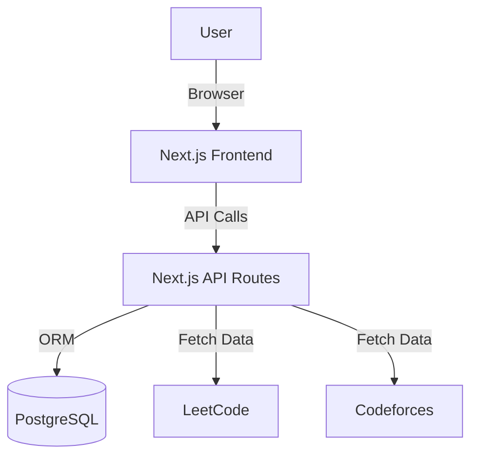

# Study Manager - System Architecture & Design

## 1. Tech Stack

### Frontend
- **Framework**: Next.js (React) - for SSR, routing, and modern features.
- **Language**: TypeScript - for type safety.
- **Styling**: Vanilla CSS (CSS Modules) / TailwindCSS (Optional, if requested later. Defaulting to modern CSS variables & Flexbox/Grid).
- **State Management**: React Context or Zustand.

### Backend
- **Framework**: Next.js API Routes (Serverless) OR Node.js/Express (Standalone). *Recommendation: Next.js API Routes for simplicity in a single repo.*
- **Database**: PostgreSQL (Supabase or Neon) or SQLite (for local MVP). *Recommendation: PostgreSQL via Prisma ORM.*
- **Language**: TypeScript.

### Integrations (External Services)
- **LeetCode API**: Unofficial GraphQL API / LeetCode Public API.
- **Codeforces API**: Official REST API (`https://codeforces.com/api/help`).

## 2. Database Schema (Draft)

### `User`
- id, username, email, preferences (json)

### `Subject`
- id, name (DSA, OS, etc.), description

### `Topic`
- id, subject_id, name, order, status (todo, in-progress, done)

### `Task`
- id, user_id, date, type (learning, problem), reference_link, status, created_at

### `Problem` (Cache)
- id, platform (leetcode, codeforces), external_id, title, difficulty, tags, link

## 3. Architecture Component Diagram

## 4. API Design

### User Management
- `GET /api/user/profile`
- `PUT /api/user/preferences` (Set daily goals, focus areas)

### Tasks
- `GET /api/tasks/daily` (Get today's generated tasks)
- `POST /api/tasks/complete` (Mark task done)
- `POST /api/tasks/generate` (Trigger auto-assignment logic)

### Content
- `GET /api/subjects`
- `GET /api/problems?platform=leetcode&tag=dp`
